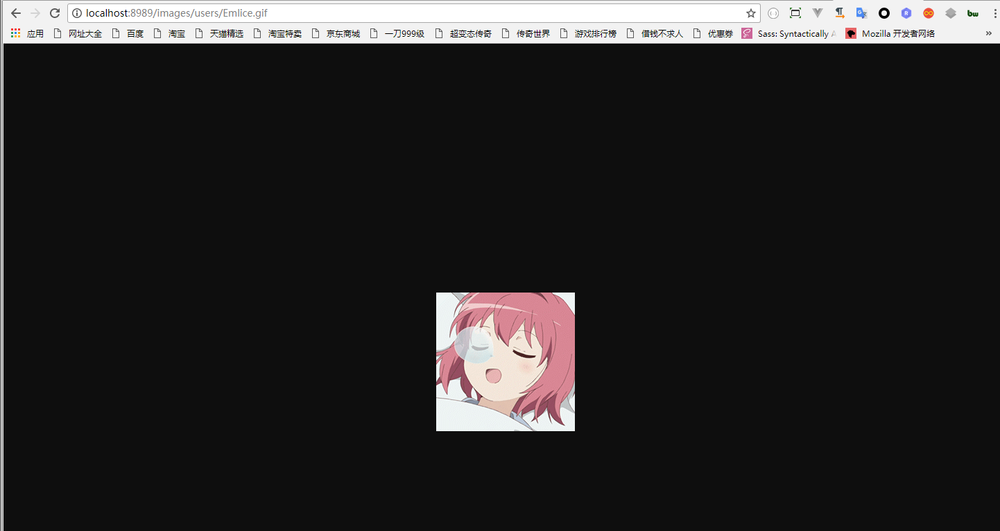

# StaticServer

[](https://travis-ci.org/yinxin630/fiora)
[](http://suisuijiang.com)
[](http://nodejs.org/download)

语言: [简体中文](REMEAD.md)

StaticServer是一个为 Emlice 项目提供静态资源存贮的静态服务器

## 功能

1. 头像上传
2. 截屏上传
3. 远程资源访问

## 安装

该项目依赖于node.js(>= 8.2.1)和mongodb数据库. 安装[node.js](https://npm.taobao.org/mirrors/node). 安装[mongodb](https://docs.mongodb.com/manual/installation/).

1. 克隆项目到本地
   `git clone git@https://github.com/zyw5791557/StaticServer`
2. 进行项目目录执行
   `yarn` 或者 `npm install`
3. 运行项目服务端
   `node index` 或 `nodemon index`
4. 打开 `http://localhost:8989` 查看效果

## 运行截图



## 目录结构

```
|-- [assets]                 // 静态资源文件夹 文件夹
|-- [config]                  // 端口,api路径配置等
|-- [server]                  // 服务器代码
|    |-- connect.js           // mongoDB连接服务
|    |-- model.js             // mongoDB表模型
|-- index.js                  // 主逻辑文件
|-- package.json              // npm
|-- yarn.lock                 // yarn
...
```